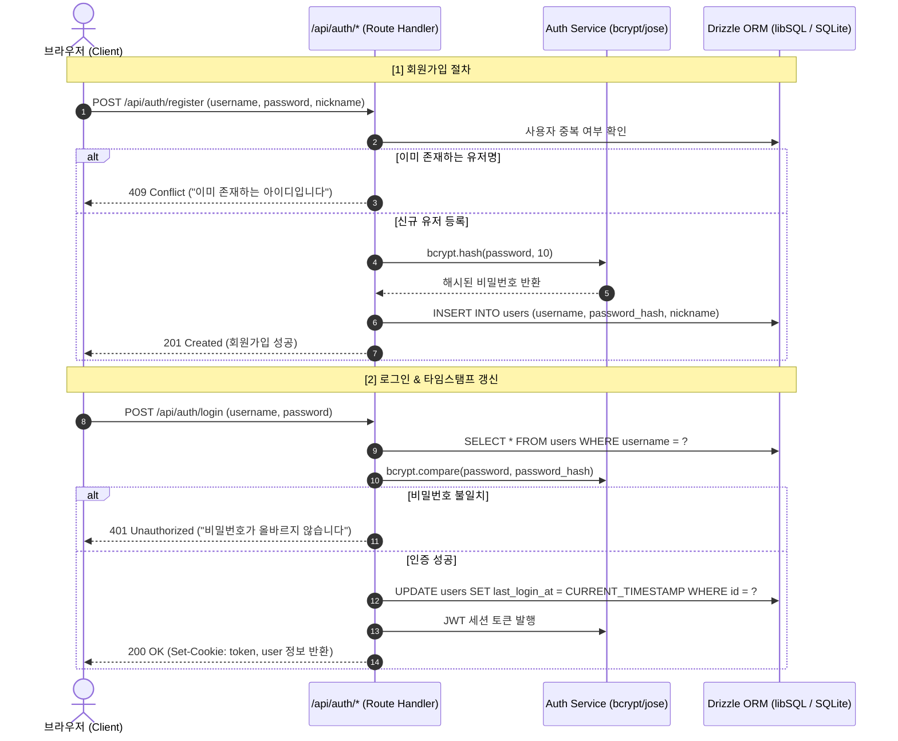
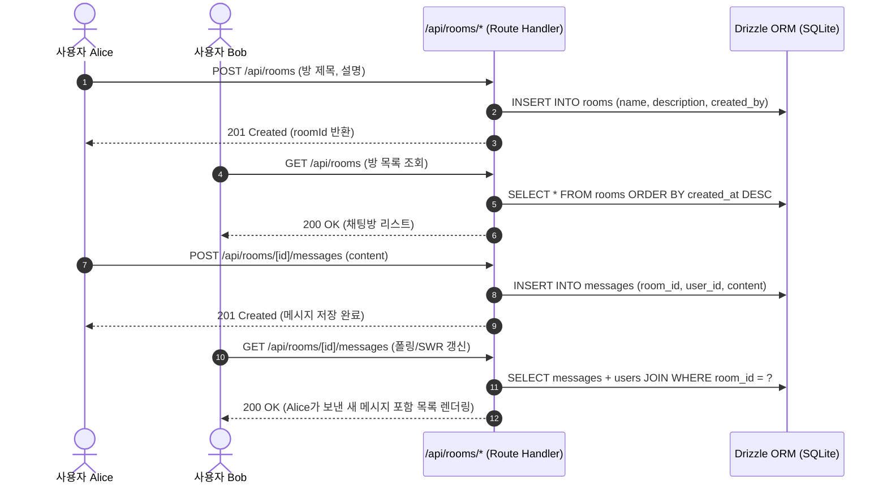

# 🏗 시스템 아키텍처 및 데이터 흐름 (System Context)

본 문서는 Vercel 서버리스 배포를 고려한 SQLite 기반 풀스택 채팅 애플리케이션의 아키텍처와 핵심 데이터 흐름을 시각화합니다.

---

## 🔄 핵심 데이터 흐름 (Data Flow)

### 1. 사용자 회원가입 및 로그인 흐름 (타임스탬프 갱신 포함)

### 2. 채팅방 생성 및 실시간 메시지 송수신 흐름

---

## 📐 아키텍처 결정 기록 (ADR)

### ADR-001: libSQL (`@libsql/client`) 및 Drizzle ORM 채택
- **결정 사항**: 표준 Node.js `better-sqlite3` 대신 `@libsql/client`와 `drizzle-orm`을 채택.
- **선정 이유 (Why)**:
  - Vercel의 Serverless 배포 환경은 컨테이너가 매 요청마다 재생성될 수 있는 Ephemeral 파일 시스템을 가집니다.
  - `@libsql/client`는 로컬 개발 시에는 `file:local.db`를 읽고 쓰는 표준 SQLite 파일 모드로 동작하며, Vercel 배포 시에는 환경변수(`TURSO_DATABASE_URL`)만 설정하면 단 1줄의 코드 변경 없이 분산 클라우드 Turso SQLite로 연결됩니다.
- **고려한 대안 및 Trade-off**:
  - *대안 1: Prisma + SQLite*: Prisma 바이너리 엔진의 용량이 크고 Vercel 서버리스 Cold-Start 레이턴시가 500ms 이상 증가할 수 있음.
  - *대안 2: better-sqlite3*: C++ 네이티브 바인딩 의존성이 있어 Vercel의 크로스 플랫폼 빌드 시 바이너리 충돌 이슈가 빈번함.
  - *선택*: Drizzle + libSQL은 순수 TS 기반으로 Cold-Start가 사실상 0ms이며 호환성이 극대화됨.

### ADR-002: 인증 세션으로 HTTP-Only Cookie + Jose (Edge-ready JWT) 채택
- **결정 사항**: 브라우저 LocalStorage가 아닌 `httpOnly`, `sameSite=lax` 보안 쿠키와 `jose` 라이브러리를 사용한 세션 관리.
- **선정 이유 (Why)**:
  - XSS(Cross-Site Scripting) 공격으로부터 토큰 탈취 방지.
  - Node.js `crypto`뿐 아니라 Vercel Edge Runtime에서도 호환되는 표준 Web Crypto API 기반 `jose` 사용.
