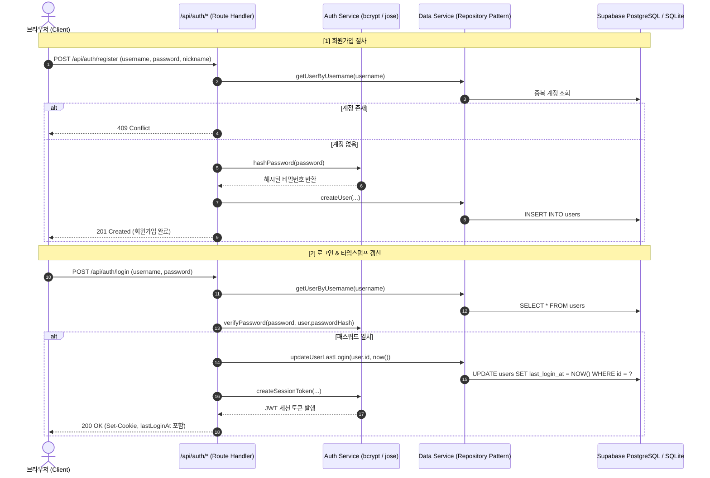
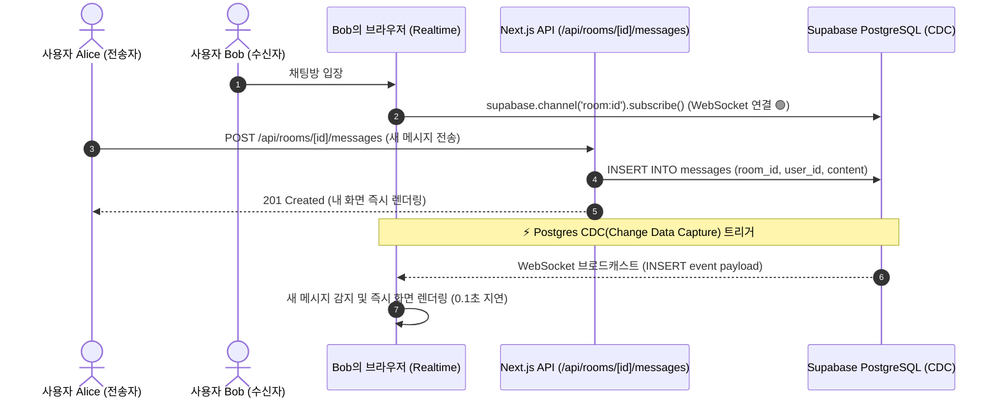

# 🏗 시스템 아키텍처 및 데이터 흐름 (System Context)

본 문서는 Vercel 서버리스 배포와 Supabase (PostgreSQL & Realtime) 연동을 반영한 시스템 아키텍처 및 핵심 데이터 흐름을 시각화합니다.

---

## 🔄 핵심 데이터 흐름 (Data Flow)

### 1. 사용자 회원가입 및 로그인 흐름 (타임스탬프 갱신 포함)

### 2. 🌟 Supabase Realtime 기반 웹소켓 실시간 메시징 흐름

---

## 📐 아키텍처 결정 기록 (ADR)

### ADR-003: Supabase (PostgreSQL & Realtime) 및 Data Service(Repository) 패턴 채택
- **결정 사항**: 기존 로컬 SQLite 파일 기반 구조에 Supabase(클라우드 PostgreSQL + Realtime WebSockets)를 유기적으로 연결하고, 비즈니스 로직과 데이터베이스 사이를 `data-service.ts`로 추상화.
- **선정 이유 (Why)**:
  - **Vercel의 Stateless 특성 극복**: 파일 시스템 휘발성 문제를 클라우드 관리형 PostgreSQL로 완전히 해소.
  - **Realtime WebSocket 전환**: 기존 3초 주기 HTTP 폴링(Polling)의 불필요한 요청 낭비를 제거하고, Supabase의 Postgres CDC 기반 웹소켓 채널을 통해 0.1초 미만의 압도적인 실시간 채팅 UX 제공.
  - **무중단 하이브리드 어댑터**: Supabase 환경변수가 없을 때는 자동으로 로컬 SQLite(`local.db`)로 안전하게 fallback 동작하도록 설계하여 개발 및 배포 유연성 확보.
